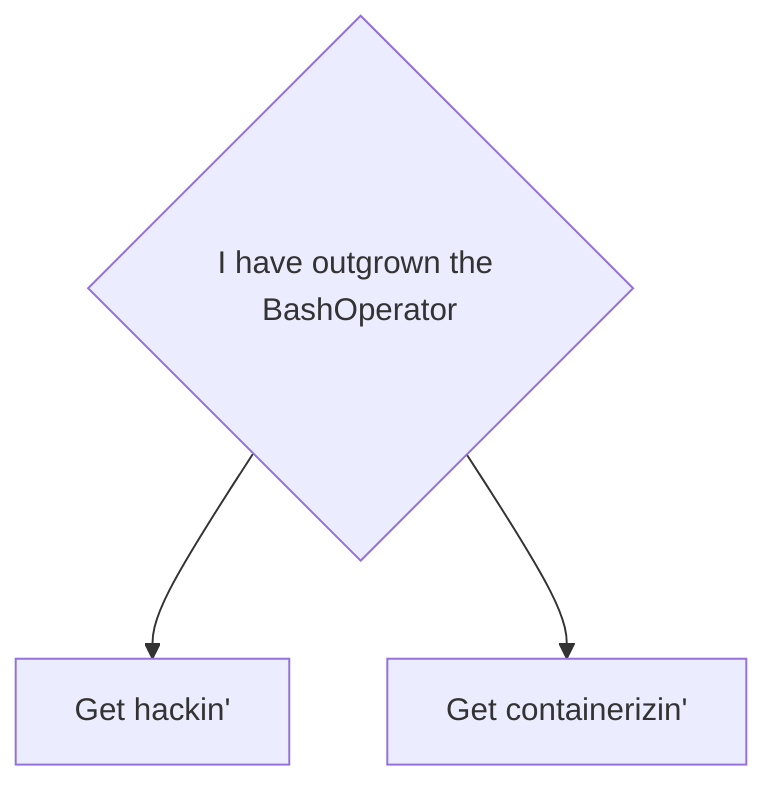
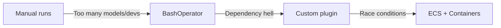

# A comedy of Airflows

Running dbt core in production the least bad way

Dean Verhey

Seattle dbt Meetup August 2023

---
transition: fade-out
---

# Who am I?

- 💼 **Currently** - Senior Data/Analytics Engineer at [LaunchDarkly](https://launchdarkly.com/)
- 👋 **Previously** - Data and/or software engineering at:
    - 💵 [Coupa Software](https://www.coupa.com/)
    - ✈️ [Yapta](https://www.geekwire.com/2020/coupa-software-acquiring-seattle-startup-yapta-help-businesses-cut-travel-costs/) (acquired by Coupa in 2020)
    - 🚒 [Emergency Reporting](https://emergencyreporting.com/)
    - 🎓 Western Washington University
    - 🛫 University of North Dakota
- 🏔️ **When not working** - Skiing, spending time with my partner and [our cat](https://deancat.netlify.app/)

<style>
h1 {
  background-color: #2B90B6;
  background-image: linear-gradient(45deg, #4EC5D4 10%, #146b8c 20%);
  background-size: 100%;
  -webkit-background-clip: text;
  -moz-background-clip: text;
  -webkit-text-fill-color: transparent;
  -moz-text-fill-color: transparent;
}
</style>

---
layout: default
---

# Agenda

<Toc></Toc>

---
layout: statement
level: 2
---

<style>
h1, h3 {color: #2B90B6;}
</style>

# _Goals_

## Know what you're getting yourself into

<br><br>

### _Help me help you:_

How many here use dbt?

How many don't and are considering implementation?

How many are responsible for running dbt in production?

---
layout: two-cols
---

# Production dbt-ing

- Can be as simple as the CLI operations you’re already familiar with
- Not very resource-intensive
  - Meaningful compute handled by DWH
- Does write out a lot of files
  - `target-path`, `packages-install-path`, `log-path` can help with this
- Still requires a Python env
- New in 1.5 - [programmatic invocations](https://docs.getdbt.com/reference/programmatic-invocations)

::right::

```bash
❯ dbt run
04:05  Running with dbt=1.5.2
04:05  Registered adapter: duckdb=1.5.2
04:05  ...
04:05  ...
04:05  ...
04:05  Completed successfully
04:05
04:05  Done. PASS=7 WARN=0 ERROR=0 SKIP=0 TOTAL=7
```
<br>

```python
from dbt.cli.main import dbtRunner, dbtRunnerResult

# initialize
dbt = dbtRunner()

# create CLI args as a list of strings
cli_args = ["run", "--select", "tag:my_tag"]

# run the command
res: dbtRunnerResult = dbt.invoke(cli_args)

# inspect the results
for r in res.result:
    print(f"{r.node.name}: {r.status}")
```

<!-- Slide 5 -->
---
layout: two-cols
---

# The first steps

- Regular manual runs
- Cron
- CI/CD tooling schedulers
  - _GitHub Actions, CircleCI, Jenkins_
- Basic cloud schedulers
  - _ECS scheduled tasks, GCP Cloud Scheduler, Azure Batch Scheduler_

TODO: Find an image/sample for this slide

---
layout: statement
level: 2
---

<style>
h1, h3 {color: #2B90B6;}
</style>

# _Checkpoint_

## When have you outgrown basic schedulers?

<br><br>

### _Some ideas:_

You run a lot of jobs for a lot of the day

You have multiple jobs running at once

Your jobs have complex dependencies

Your platform team says CircleCI costs too much

---
layout: two-cols
---

# Orchestrators

- For more complex scheduling
  - Running more than just dbt
  - Managing multiple dbt runs
  - Coupling your ingestion with dbt
  - Other ways to start jobs (i.e. sensors)
  - Define your jobs in Python
- We’re going to talk about Airflow, but there’s alternatives
  - Dagster
  - Prefect
  - Newer: Mage, Argo
  - Older: Luigi, Oozie, Azkaban
- [Is it Pokemon or Big Data?](https://pixelastic.github.io/pokemonorbigdata/)

::right::


<br>


---
layout: default
---
# Starting out with Airflow via the BashOperator

```python {10|15|18|all} {lines: true}
with DAG(
    dag_id="example_bash_operator",
    schedule="@hourly",
    start_date=datetime.datetime(2023, 8, 10),
    catchup=False,
) as dag:

    run_dbt = BashOperator(
        task_id="run_dbt",
        bash_command="dbt run --profile prod",
    )

    test_dbt = BashOperator(
        task_id="test_dbt",
        bash_command="dbt test --profile prod",
    )

run_dbt >> test_dbt
```

_"Starting today, run `dbt run`, then `dbt test` once an hour at the top of the hour"_

---
layout: two-cols
---

# BashOperator issues

- **Requirements whack-a-mole**
  - [One of the many dbt-snowflake GH issues about installing dbt on MWAA](https://github.com/dbt-labs/dbt-snowflake/issues/687)
  - [Official AWS MWAAA guide about working around conflicting dependencies](https://docs.aws.amazon.com/mwaa/latest/userguide/samples-dbt.html)
- **File writing conflicts**
  - Concurrent runs can step on each other
- **Lifecycle conflicts**
  - Upgrading dbt involves Airflow requirements changes
  - In some managed services this can mean downtime

TODO: Find a suitable image/right content for this slide

---
layout: statement
level: 2
---

<style>
h1, h3 {color: #2B90B6;}
</style>

# _Checkpoint_

## When have you outgrown the bash operator?

<br><br>

### _Some ideas:_

You are in dependency hell

You are in race condition hell

---
layout: two-cols
---

# What now?



::right::

- **Get hackin’**
  - `PythonVirtualenvOperator`
  - Call a full script from the BashOperator
    - Create a venv
    - Install dependencies to that venv
    - Run dbt
    - Clean up?
- **Get containerizin’**
  - Isolate dbt from Airflow
  - Trade code complexity for infra complexity

---
layout: default
---

# Containerization Basics

- In Airflow: `DockerOperator` -> `ECSOperator` -> `KubernetesPodOperator`
  - Each isolate your tasks from others
  - Each require some infra work outside Airflow (K8s cluster, ECS cluster, container registry)
- In general - why containerize?
  - Scalability - vertically and horizontally
  - Isolation
- Downsides
  - Architectural complexity
  - Local dev gets even more difficult

---
layout: default
---
# Running dbt via the ECSOperator

```python {14|all} {lines: true}
with DAG(
  # same as before
) as dag:
    run = ECSOperator(
        task_id="run",
        dag=dag,
        cluster="YOUR_CLUSTER_GOES_HERE,
        task_definition="YOUR_TASK_DEF_GOES_HERE",
        launch_type="FARGATE",
        overrides={
            "containerOverrides": [
                {
                    "name": "ecs-airflow-dbt-task",
                    "command": [f"dbt run --profile prod"],
                }
            ],
        },
        network_configuration={"YOUR_NETWORK": "CONF_GOES_HERE"},
    )
```

_Not pictured: a **lot** of IAM work_

---
layout: statement
level: 2
---

<style>
h1, h3 {color: #2B90B6;}
</style>

# _Checkpoint_

## When have you outgrown this?

<br><br>

### _Some ideas:_

You maybe shouldn't have been here to begin with

You have outgrown Airflow, dbt, or batch processing

---
layout: statement
---

# What we did at LaunchDarkly

<br>


---
layout: two-cols
level: 2
---

# The early days

_Disclaimer: I wasn’t actually here for most of this_

- With minimal SLAs, someone ran dbt locally
- Moved to Airflow 1 on GCP using GCP Composer
  - BashOperator first, “custom” Python plugin second
  - Forked from gocardless/airflow-dbt
  - Per task, created Python virtualenvs in /tmp
- Dbt project manually deployed to /dags folder of GCS after every merge

::right::

- 20-50 models
- \<10m total runtime
- 1-2 devs
- 2-3 deploys per week

- TODO: Fix slide formatting

---
layout: two-cols
level: 2
---

# The GCP days

- Python plugin mostly worked for a long time
- 10ish dbt tasks per day
- Team grew from 2 to 4 in 2021, and from 4 to 8 in 2022
- dbt models grew from ~20 to ~200
- Runtime grew from 1h to 4h
- SLAs got tighter - some models running hourly, most still twice daily
- Apple Silicon prompted a surprise dbt upgrade
- LaunchDarkly is not a GCP shop - and AWS had a managed Airflow product now

::right::

- 200+ models
- 4h total runtime
- 4-8 devs
- 2-3 deploys per day

- TODO: Fix slide formatting

---
layout: two-cols
level: 2
---

# The AWS migration

- Team grew, systems did not
- Manual deploys happen 4-5 times per day and take 30 minutes
- Plan was to lift and shift to AWS MWAA
- Same Airflow version, same dbt version, same custom plugin code
- Ran into tons of problems with that lift/shift
  - Different executor configuration on MWAA and GCP
  - MWAA plugin deploys cause partial downtime
- Re-architected to use ECS Fargate

::right::

- 600+ models
- 6h total runtime
- 8 devs
- 4-5 deploys per day

---
layout: two-cols
level: 2
---

# The end

- Now 7 devs, still 600 dbt models, now 2.5h runtime
- Deploys automated in CircleCI - still deploying 4-5 times per day
- ~60 dbt tasks running per day
- dbt + dependency upgrades more manageable
- Datadog + Cloudwatch for monitoring
- ECS spend <$10/month
- Extra complexity around manually stopping tasks
- Local dev still impossible
- Next steps:
  - Airflow 1 -> Airflow 2
  - Downsizing our dbt project

::right::

- Still 600 models
- 2.5h total runtime
- 7 devs
- 4-5 deploys per day

- TODO: Fix slide formatting

---
layout: statement
---

# Is this… good?

<br>
😬 I think this is the most scalable way to run dbt on Airflow

🙂 We’re happy with it for our workload

🫠 It feels more complex than it needs to be

🚦 SLAs are all green, and we have plenty of headroom to scale

---
layout: end
---

# Thank you!

<br><br><br><br>
## Contact:

[linkedin/deanverhey](https://www.linkedin.com/in/deanverhey/)

[github/verhey](https://github.com/verhey)

[Slide source code](https://github.com/verhey) # todo: update!
