# A comedy of Airflows

Adventures with production-izing dbt core

Dean Verhey

Seattle dbt Meetup August 2023

---
layout: two-cols
---

# Who am I?


::right::

- 💼 **Currently** - Senior Data/Analytics Engineer at [LaunchDarkly](https://launchdarkly.com/)
  - LD is a dev tools company - feature management and experimentation
- 👋 **Previously** - Data or software engineering at:
    - 💵 [Coupa Software](https://www.coupa.com/)
    - ✈️ [Yapta](https://www.geekwire.com/2020/coupa-software-acquiring-seattle-startup-yapta-help-businesses-cut-travel-costs/) (acquired by Coupa in 2020)
    - 🚒 [Emergency Reporting](https://emergencyreporting.com/)
    - 🎓 Western Washington University
    - 🛫 University of North Dakota
- 🏔️ **When not working** - Skiing, spending time with my partner and [our cat](https://deancat.netlify.app/)

---
layout: default
---

# Agenda

<Toc></Toc>

---
layout: statement
---

<style>
h1, h3 {color: #2B90B6;}
</style>

# Goal

## Know what you're getting yourself into

<br><br>

### _Help me help you:_

How many here use dbt?

How many don't and are considering implementation?

How many are responsible for running dbt in production?

---
layout: two-cols
---

# Production dbt-ing

- Can be as simple as the CLI operations you’re already familiar with
- Not very resource-intensive
  - Meaningful compute handled by DWH
- Does write out a lot of files
  - `target-path`, `packages-install-path`, `log-path` can help with this
- Still requires a Python env
- New in 1.5 - [programmatic invocations](https://docs.getdbt.com/reference/programmatic-invocations)

<br><br>
👉 `dbt run` via programmatic and CLI invocations

::right::

```
❯ dbt run
04:05  Running with dbt=1.5.2
04:05  Registered adapter: duckdb=1.5.2
04:05  ...
04:05  ...
04:05  ...
04:05  Completed successfully
04:05
04:05  Done. PASS=7 WARN=0 ERROR=0 SKIP=0 TOTAL=7
```
<br>

```python
from dbt.cli.main import dbtRunner, dbtRunnerResult

# initialize
dbt = dbtRunner()

# create CLI args as a list of strings
cli_args = ["run", "--select", "tag:my_tag"]

# run the command
res: dbtRunnerResult = dbt.invoke(cli_args)

# inspect the results
for r in res.result:
    print(f"{r.node.name}: {r.status}")
```

<!-- Slide 5 -->
---
layout: two-cols
---

# The first steps

- **Regular manual runs**
- **Cron**
- **CI/CD tooling schedulers**
  - GitHub Actions
  - CircleCI
  - Jenkins
- **Basic cloud schedulers**
  - ECS scheduled tasks
  - GCP Cloud Scheduler
  - Azure Batch Scheduler

::right::


<br>

```shell
❯ crontab -l
# run dbt every hour
0 0 * * * dbt run
```

<br>

```yml
# .circleci/config.yml
jobs:
  run-dbt:
    steps: [checkout, {"run": "dbt run"}]
workflows:
  daily-run-dbt:
    jobs:
      - run-dbt:
          triggers: [{"schedule": {"cron": "0 0 * * *"}}]
```

---
layout: statement
hideInToc: true
---

# _Checkpoint_

## When have you outgrown basic schedulers?

<br><br>

### _Some ideas:_

You run a lot of jobs for a lot of the day

You have multiple jobs running at once

Your jobs have complex dependencies

Your platform team says CircleCI costs too much

---
layout: two-cols
---

# Orchestrators

- **For more complex scheduling**
  - Running more than just dbt
  - Managing multiple dbt runs
  - Coupling your ingestion with dbt
  - Other ways to start jobs (i.e. sensors)
  - Define your jobs in code
- **We’re going to talk about Airflow, but there’s alternatives**
  - dbt Cloud
  - Established: Dagster, Prefect
  - Newer: Mage, Argo
  - Older: Luigi, Oozie, Azkaban
  - [Is it pokemon or big data?](https://pixelastic.github.io/pokemonorbigdata/)

::right::


---
layout: default
---

# Starting out with Airflow via the BashOperator

```python {all|10,15|18|all} {lines: true}
with DAG(
    dag_id="example_bash_operator",
    schedule="@hourly",
    start_date=datetime.datetime(2023, 8, 10),
    catchup=False,
) as dag:

    run_dbt = BashOperator(
        task_id="run_dbt",
        bash_command="dbt run --profile prod",
    )

    test_dbt = BashOperator(
        task_id="test_dbt",
        bash_command="dbt test --profile prod",
    )

run_dbt >> test_dbt
```

_"Starting today, run `dbt run`, then `dbt test` once an hour at the top of the hour"_

---
layout: two-cols
hideInToc: true
---

# BashOperator issues

- **Requirements whack-a-mole**
  - 🫠 [Official AWS MWAAA guide about working around conflicting dependencies](https://docs.aws.amazon.com/mwaa/latest/userguide/samples-dbt.html)
- **File writing conflicts**
  - dbt artifacts + target + logs can be overwritten by concurrent DAG runs - or not written at all
    - Differs between managed Airflow services
  - 💭 If redirecting to `/tmp`, clean it up!
- **Lifecycle conflicts**
  - Upgrading dbt involves requirements changes for your entire Airflow instance
  - In some managed services this can mean downtime


::right::


---
layout: statement
hideInToc: true
---

<style>
h1, h3 {color: #2B90B6;}
</style>

# _Checkpoint_

## When have you outgrown the bash operator?

<br><br>

### _Some ideas:_

You are in dependency hell

You are in concurrency hell

---
layout: two-cols
hideInToc: true
---

# What now?

- 🤠 **Get hackin’**
  - `PythonVirtualenvOperator`
  - Call a full script from the BashOperator or PythonOperator
    1. Create a venv
    2. Install dependencies to that venv
    3. Run dbt
    4. Clean up*
- 🐳 **Get containerizin’**
  - Isolate dbt from Airflow
  - Trade code complexity for infra complexity
  - Give Airflow much less to do

::right::
```python {all|3-12|14-16|18-19|21-22|26|all} {lines: true}
base_script = """
    set -e
    # 1) make a venv namespaced with the task
    RUN_ID={{ task.task_id ~ '_' ~ run_id }}
    CLEAN_RUN_ID=$(echo $RUN_ID | tr :+. _)

    mkdir /tmp/$CLEAN_RUN_ID
    DBT_VENV_DIR=/tmp/$CLEAN_RUN_ID/dbt_venv

    /usr/bin/python3 -m virtualenv \
      --python /usr/bin/python3 \
      --creator venv --always-copy $DBT_VENV_DIR

    # 2) Install dependencies to that venv
    $DBT_VENV_DIR/bin/pip3 install -r \
      $DBT_PROFILES_DIR/dbt_requirements.txt

    # 3) run dbt - dbt command envvar set in operator
    $DBT_VENV_DIR/bin/dbt $DBT_COMMAND

    # 4) clean up
    rm -rf $DBT_VENV_DIR
"""
run = BashOperator(
  bash_command=base_script,
  env={"DBT_COMMAND" = "run --profile prod"}
)
```

---
layout: two-cols
---

# Containerization Basics

- `DockerOperator`, `ECSOperator`, or `KubernetesPodOperator`
  - Each isolate your tasks from others
  - Each require some infra work outside Airflow (K8s cluster, ECS cluster, container registry)
- In general - why containerize?
  - Scalability - vertically and horizontally
  - Isolation
- Downsides
  - Complexity
  - In the context of Airflow, local dev gets even more difficult

::right::


---
layout: default
---

# Running dbt via the ECSOperator

```python {all|14} {lines: true}
with DAG(
  # same as before
) as dag:
    run = ECSOperator(
        task_id="run",
        dag=dag,
        cluster="dbt-airflow-cluster",
        task_definition="dbt-airflow-task-def",
        launch_type="FARGATE",
        overrides={
            "containerOverrides": [
                {
                    "name": "ecs-airflow-dbt-task",
                    "command": ["dbt run --profile prod"],
                }
            ],
        },
        network_configuration={"YOUR_NETWORK": "CONF_GOES_HERE"},
    )
```

_Not pictured: a lot of infra work_

_Create an ECS cluster, create an ECS task definition, create an ECR repo, let them talk to each other..._

---
layout: statement
hideInToc: true
---

<style>
h1, h3 {color: #2B90B6;}
</style>

# _Checkpoint_

## When have you outgrown this?

<br><br>

### _Some ideas:_

You maybe shouldn't have been here to begin with

You have outgrown Airflow, dbt, or batch processing

---
layout: statement
---

# What we did at LaunchDarkly

<br>


---
layout: statement
hideInToc: true
---

# The early days

_Disclaimer: I wasn’t actually here for most of this_


📆 _2019-2021_

📚 _20-50 models_

⌚️ _\<10m total runtime_

🤓 _1-3 devs_

🎫 _2-3 deploys per week_

---
layout: statement
hideInToc: true
---

# The GCP days


📆 _2021-2022_

📚 _200+ models_

⌚️ _4h total runtime_

🤓 _4-6 devs_

🎫 _15+ deploys per week_

---
layout: statement
hideInToc: true
---

# The AWS migration

```mermaid
%%{init: {'theme':'dark'}}%%
flowchart LR
   A[GCP is so 2021]:::inactive
   --> B[The plugin no longer 'just works' \n Our systems did not evolve with our team \n LaunchDarkly is not a GCP shop]:::active
   -- "Lift and shift 🙏"
   --> C[Shifted to MWAA, things largely fine \n As we gradually cutover DAGs, things are not fine \n We learn how Airflow actually works]:::active
   -- We give up on the lift and shift
   --> D[dbt operations moved to ECS Fargate \n Deploys fully automated \n Plugin deleted]:::active
    classDef active fill:teal
    classDef inactive opacity:50%,stroke-dasharray: 5 5
```



📆 _2022-2023_

📚 _600+ models_

⌚️ _6h total runtime_

🤓 _6-8 devs_

🎫 _20+ deploys per week_

---
layout: statement
hideInToc: true
---
# Today


📆 _2023+_

📚 _600+ models_

⌚️ _2.5h total runtime_

🤓 _7 devs_

🎫 _20+ deploys per week_

---
layout: statement
---

# Is this… good?

<br>

😬 I think this is the most scalable way to run dbt on Airflow

🙂 We’re happy with it for our workload

🫠 It feels more complex than it needs to be

🐙 Airflow is probably not the executor of the future

🚦 SLAs are all green, and we have plenty of headroom to scale

---
layout: end
---

# Thank you!

<br><br><br><br>
## Contact:

[linkedin/deanverhey](https://www.linkedin.com/in/deanverhey/)

[github/verhey](https://github.com/verhey)

[dbt Slack @Dean Verhey](https://getdbt.slack.com/archives/D021HPX8VL7)

Slides link: [dean-meetup-slides.netlify.app](https://dean-meetup-slides.netlify.app/)

Slide source code: [github/verhey/dbt-meetup-slides](https://github.com/verhey/dbt-meetup-slides)
